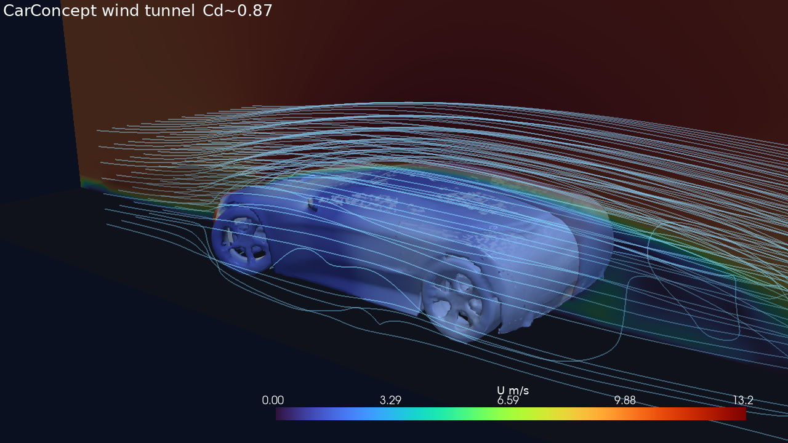
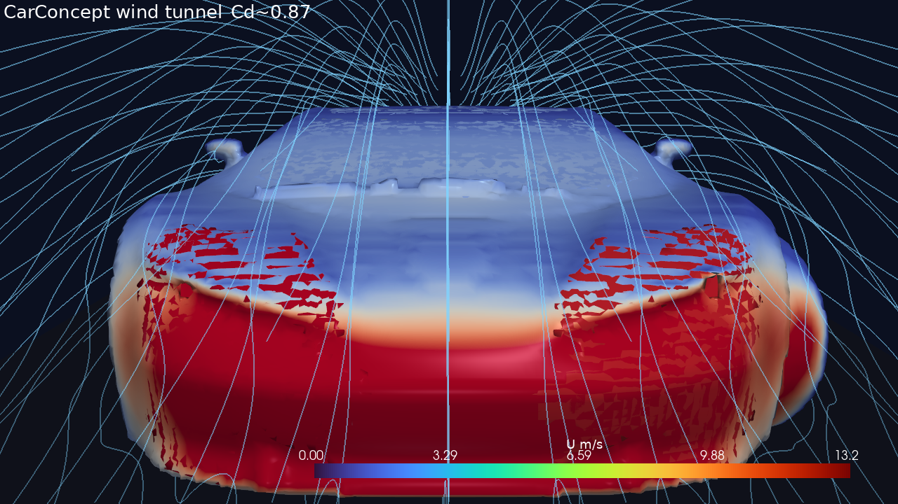
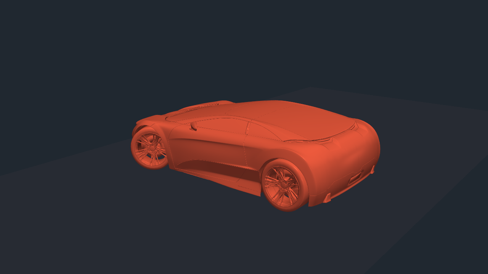
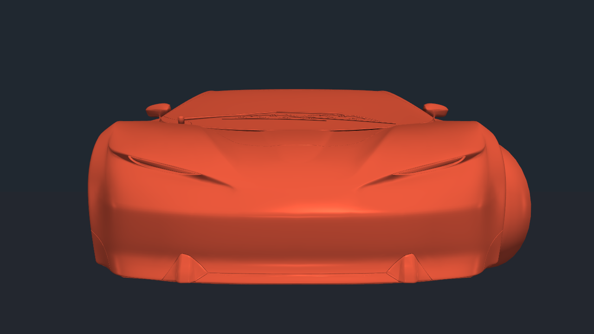
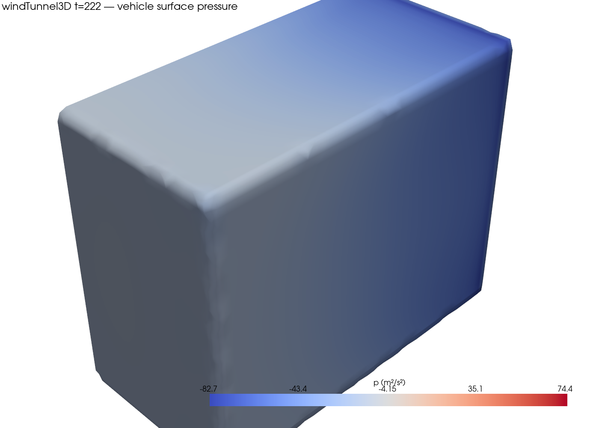
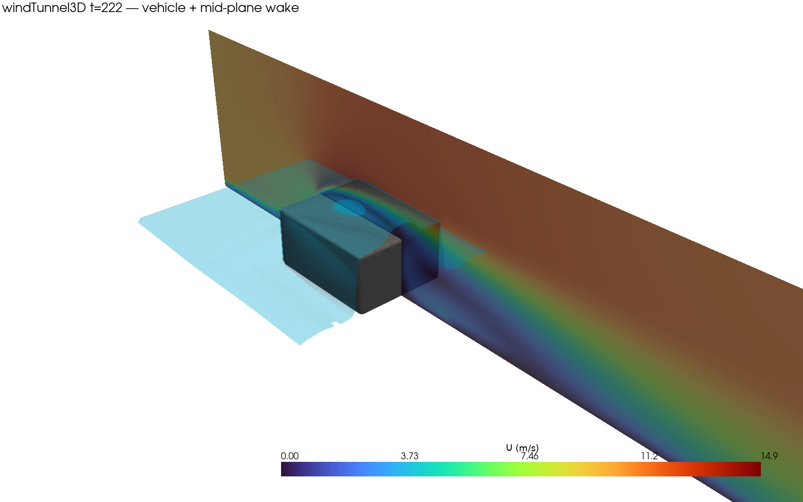
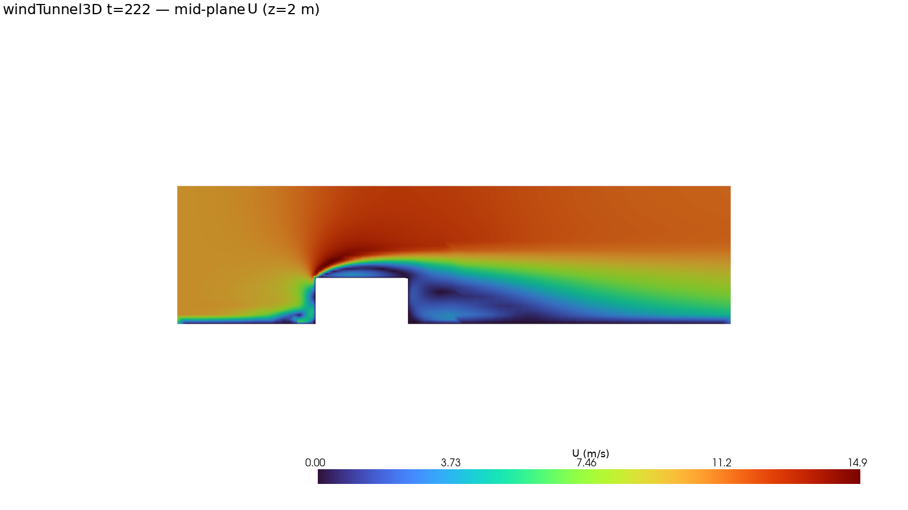
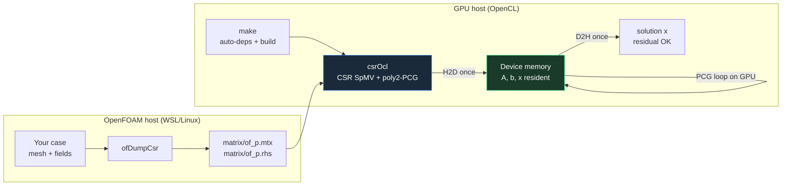

# PFC — 3D CFD you can show + device-resident GPU solvers

Revival of the 2015 thesis project  
***Análisis e Implementación de Resolutores Lineales en GPGPU aplicados a OpenFOAM®***  
Repo: [Thejuampi/PFC](https://github.com/Thejuampi/PFC)

---

## What this is

Two tracks, one repo:

| Track | Goal | Status |
|-------|------|--------|
| **Primary v1** | Showable **3D wind-tunnel CFD** on stock OpenFOAM | **done** |
| **Primary v2** | That same solve loop **device-resident on GPU** (assemble + sparse solves + field updates) | **active** |
| Secondary | Full-device OpenCL Laplace / CSR PCG ladder toward v2 | **done** (building blocks) |

Not a hybrid “offload one kernel per iteration” design — the 2015 lesson was that **CPU↔GPU thrash** kills you. See [`docs/GOALS.md`](docs/GOALS.md) and [`docs/S5_DEVICE_SEGMENT.md`](docs/S5_DEVICE_SEGMENT.md).

---

## Showcase — concept car in a wind tunnel

**Case:** [`cases/windTunnelCar`](cases/windTunnelCar)  
Real concept-car body (**Khronos CarConcept**), `snappyHexMesh` + `simpleFoam` RAS k-ε, force coefficients.

| | |
|:--:|:--:|
|  |  |
| Side ¾ · surface *p* · midplane \|U\| · streamlines | Front · high pressure on nose |

| Geometry (side) | Geometry (front) |
|:--:|:--:|
|  |  |

**Demo numbers (this machine):**

| Item | Value |
|------|--------|
| Length | 4.2 m |
| Free stream | 10 m/s |
| Mesh | ~1.2 M cells |
| **Cd** | **≈ 0.87** |
| Animation | 30 s @ 30 fps, fixed camera, air from the inlet |

**Video:** [`cases/windTunnelCar/images/windTunnelCar_airflow_30s_30fps.mp4`](cases/windTunnelCar/images/windTunnelCar_airflow_30s_30fps.mp4)

```powershell
# Full CFD (WSL OpenFOAM on G:)
wsl -d Ubuntu-OF -- openfoam2512 -c "cd /mnt/g/dev/repos/PFC/cases/windTunnelCar && sed -i 's/\r$//' Allrun Allclean && bash Allrun"

# VTK + airflow animation (Windows)
wsl -d Ubuntu-OF -- openfoam2512 -c "cd /mnt/g/dev/repos/PFC/cases/windTunnelCar && foamToVTK -latestTime"
python cases\windTunnelCar\scripts\render_animation.py
```

Details: [`cases/windTunnelCar/README.md`](cases/windTunnelCar/README.md)

---

## Also: bluff-box tunnel (first 3D milestone)

**Case:** [`cases/windTunnel3D`](cases/windTunnel3D) — simple boxed vehicle, same RAS + forceCoeffs stack.

| Pressure on vehicle | Wake slice | Midplane speed |
|:--:|:--:|:--:|
|  |  |  |

Converges ~222 iters · **Cd ≈ 1.25**, **Cl ≈ 0.63** (bluff demo body, ν = 0.01).

```powershell
wsl -d Ubuntu-OF -- openfoam2512 -c "cd /mnt/g/dev/repos/PFC/cases/windTunnel3D && sed -i 's/\r$//' Allrun Allclean && bash Allrun"
```

---

## GPU path (full-device OpenCL)

Windows host + **AMD Radeon RX 6800 XT**. One upload → assemble + PCG on device → one download of the solution.

### Architecture



**Rule:** matrix/fields live on the GPU for the whole solve — not copy-per-iteration (that was the 2015 trap).

| App | Role |
|-----|------|
| [`apps/laplaceOcl`](apps/laplaceOcl) | Structured 2D/3D DIA Laplace, poly2, residual gate, VRAM stress |
| [`apps/csrOcl`](apps/csrOcl) | Unstructured-ready **CSR** SpMV + PCG |
| [`apps/ofDumpCsr`](apps/ofDumpCsr) | Dump real OpenFOAM `laplacian(p)` → Matrix Market for the GPU |
| [`scripts/polyMesh_to_mtx.py`](scripts/polyMesh_to_mtx.py) | polyMesh topology → CSR |

```powershell
make            # build + test (OpenCL headers auto-downloaded on first run)
make run        # quick demo of both apps
```

Needs: `g++`, `curl`, GPU OpenCL driver. No manual third-party install.

### Integrate with *your* OpenFOAM (people + agents)

**→ Full guide: [`docs/INTEGRATE_OPENFOAM.md`](docs/INTEGRATE_OPENFOAM.md)**  
**→ Agent checklist: [`AGENTS.md`](AGENTS.md)**

Supported **today** = **Mode A (export)**: dump the pressure system from any case, solve on the GPU. Not a silent drop-in `lduMatrix` replacement yet (that is primary v2 / Mode B–C).

```powershell
# 1) Device solver (once)
make

# 2) OF bridge + dump (OpenFOAM env / WSL)
wsl -d Ubuntu-OF -- openfoam2512 -c "cd /mnt/g/dev/repos/PFC/apps/ofDumpCsr && wmake"
wsl -d Ubuntu-OF -- openfoam2512 -c "cd /mnt/g/dev/repos/PFC/cases/windTunnel3D && ofDumpCsr"

# 3) GPU solve
.\build\csrOcl\csrOcl.exe --mtx cases\windTunnel3D\matrix\of_p.mtx --rhs cases\windTunnel3D\matrix\of_p.rhs --kernels build\csrOcl\kernels\csr.cl
```

Demonstrated: **n ≈ 77k, nnz ≈ 536k**, residual OK, solve **~70 ms** on GPU.

Same three steps work for **any** case with mesh + `p`/`U` fields — see the integration doc.

Roadmap: [`docs/AMD_GPU_ROADMAP.md`](docs/AMD_GPU_ROADMAP.md) · device segment: [`docs/S5_DEVICE_SEGMENT.md`](docs/S5_DEVICE_SEGMENT.md) · goals: [`docs/GOALS.md`](docs/GOALS.md)

---

## Machine setup (this revival)

| Item | Value |
|------|--------|
| Distro | WSL2 **Ubuntu-OF** (24.04) |
| Distro disk | **`G:\wsl\...`** (not C:) |
| OpenFOAM | **v2512** |
| CPU baseline | `cases/laplaceCpu` + stock `laplacianFoam` |
| Policy | Keep heavy tooling off C: — [`docs/WSL_ON_G.md`](docs/WSL_ON_G.md) |

```powershell
# CPU smoke
wsl -d Ubuntu-OF -- openfoam2512 -c "cd /mnt/g/dev/repos/PFC && bash scripts/run-laplace-cpu.sh"
```

---

## Layout

```
cases/windTunnelCar/   # ★ main visual demo — concept car + airflow video
cases/windTunnel3D/    # bluff-box 3D milestone
cases/laplaceCpu/      # stock laplacianFoam reference
apps/laplaceOcl/       # full-device OpenCL DIA Laplace
apps/csrOcl/           # full-device CSR SpMV+PCG
apps/ofDumpCsr/        # OF → Matrix Market for GPU
docs/                  # goals, S5 segment, WSL-on-G
docs/images/           # README gallery stills
scripts/               # build/run/bench helpers
cpp/                   # LEGACY 2015 (archive — do not expect to build)
latex/                 # original thesis sources
deps/                  # auto cache (gitignored) — you never touch this
cmake/                 # auto-fetch helpers if you use CMake
```

---

## Design note

CPU OpenFOAM is the **reference** (fields, residuals, Cd/Cl, pictures).  
The product bet is a **full-device lifecycle** for the outer SIMPLE-class loop — not shipping mesh generation or ParaView to the GPU.

Legacy stack (OpenFOAM 2.4 / Paralution / SpeedIT under `cpp/`) stays as historical archive.

---

## License / credits

- Code: see repo `LICENSE`
- CarConcept mesh: © 2024 Darmstadt Graphics Group GmbH — **CC BY 4.0**  
  ([Khronos glTF Sample Assets](https://github.com/KhronosGroup/glTF-Sample-Assets/tree/main/Models/CarConcept))
- OpenFOAM® is a registered trademark of OpenCFD Ltd
