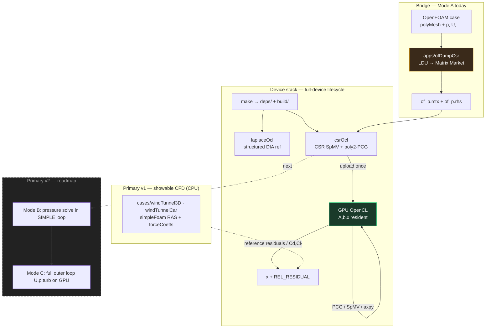
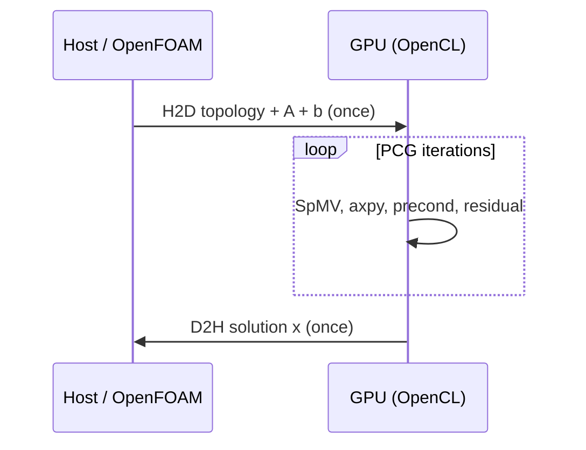
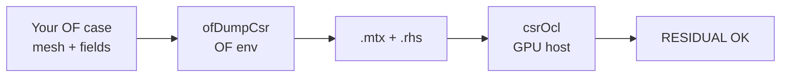

# How to integrate PFC device solvers with *your* OpenFOAM

This is the **canonical integration guide** for people and coding agents.

Read this before wiring PFC into any OpenFOAM case, fork, or custom solver.

---

## Architecture (big picture)



**Data residency (correct):**



**Anti-pattern (forbidden thrash):**

```text
each iter:  CPU assemble A → H2D(A) → GPU kernel → D2H(x)   ✗
```

---

## GPU vs CPU speedup (what counts)

Primary scientific question and fair protocol: **[`CPU_GPU_SPEEDUP.md`](CPU_GPU_SPEEDUP.md)**.

- Same car-tunnel pressure \(A,b\); GPU poly2-PCG vs **OpenMP** host poly2-PCG.  
- `simpleFoam` wall = **context only**, not the speedup denominator.  
- `make bench-speedup` on an **idle** machine.

---

## 0. What “the library” is today (honest scope)

PFC is **not** yet a drop-in `libPfcOcl.so` that silently replaces every `lduMatrix` solve inside stock `simpleFoam`.

| Piece | Role | Ready? |
|-------|------|--------|
| [`apps/csrOcl`](../apps/csrOcl) | Full-device **CSR SpMV + poly2-PCG** (OpenCL). Solves \(A x = b\) on the GPU with **one matrix upload**. | **yes** |
| [`apps/ofDumpCsr`](../apps/ofDumpCsr) | OpenFOAM utility: assemble pressure Laplacian LDU → **Matrix Market** (`.mtx` + `.rhs`). | **yes** |
| [`scripts/polyMesh_to_mtx.py`](../scripts/polyMesh_to_mtx.py) | Topology-only graph Laplacian from `polyMesh` (no coefficients). | **yes** |
| [`apps/laplaceOcl`](../apps/laplaceOcl) | Structured 2D/3D DIA reference (training / metrics), not for arbitrary OF meshes. | **yes** |
| In-loop SIMPLE pressure replace (v2a) | Device solve *inside* the outer iteration | **next** — design in [`S5_DEVICE_SEGMENT.md`](S5_DEVICE_SEGMENT.md) |
| Full SIMPLE on GPU (v2b) | U, p, turbulence assemble+solve resident | **not yet** |

**Architecture rule (do not violate):**

```text
startup:  topology + A + b  → GPU   (once per system, or once if A frozen)
loop:     SpMV / PCG / axpy on GPU only
shutdown: download x        (once)
```

**Forbidden pattern (2015 failure mode):**

```text
every PCG iter / every SIMPLE iter:
  assemble A on CPU → H2D(A) → GPU solve → D2H(x)
```

If your integration re-uploads the full matrix every call, you are **not** using PFC correctly.

---

## 1. Supported integration modes

### Mode A — Export / offline (available **now**)

Use this to prove that *your* case’s pressure (or other) system is solvable on the device.



**This is the default path for external users and agents today.**

### Mode B — In-loop pressure (v2a, next)

Same CSR solver, but called from a modified `simpleFoam` (or function object) so \(p\) is solved on the device **without** writing Matrix Market every outer iteration. Topology stays on device; coefficients may update in-place.

### Mode C — Full outer loop (v2b, goal)

Assemble + solve for U, p, turbulence on device. Host only I/O and mesh tools.

Agents implementing Mode B/C **must** read [`GOALS.md`](GOALS.md) + [`S5_DEVICE_SEGMENT.md`](S5_DEVICE_SEGMENT.md) and keep Mode A green as the regression gate.

---

## 2. Prerequisites

| Side | Need |
|------|------|
| OpenFOAM | v2412 / v2512-class (this repo uses **v2512**). Case with `polyMesh` + fields `p`, `U` (and `phi` if you extend the dump). |
| GPU host | OpenCL ICD (AMD/NVIDIA/Intel). Build: `g++`, `curl`. Windows MinGW: `gendef`/`dlltool` used automatically. |
| Network (first build only) | Khronos OpenCL headers auto-download into `deps/`. |

```powershell
# From repo root — no manual third-party install
make          # build + smoke test device apps
```

OpenFOAM tools (`ofDumpCsr`, `wmake`) run **where OpenFOAM is installed** (WSL/Linux), not necessarily on the Windows GPU host.

---

## 3. Integrate with *your* case (Mode A — step by step)

Replace `YOUR_CASE` with your case path (absolute path that OpenFOAM can see).

### 3.1 Build the dump utility (once)

```bash
# Inside OpenFOAM environment
cd /path/to/PFC/apps/ofDumpCsr
wmake
# installs to $FOAM_USER_APPBIN/ofDumpCsr
which ofDumpCsr
```

### 3.2 Prepare the case

Your case must have:

- `constant/polyMesh/` (or `constant/polyMesh` via `blockMesh`/`snappyHexMesh`)
- Time directory with at least `p` and `U` (typically `0/` or a finished run)

```bash
cd /path/to/YOUR_CASE
# if needed:
blockMesh            # or your mesh pipeline
# optional but recommended: run a few simpleFoam iters so p is non-trivial
simpleFoam
```

### 3.3 Dump the pressure matrix

```bash
cd /path/to/YOUR_CASE
ofDumpCsr
```

Writes:

| File | Format | Content |
|------|--------|---------|
| `matrix/of_p.mtx` | Matrix Market **coordinate** real general | CSR-able \(A\) from `fvm::laplacian(p)` (+ reference row) |
| `matrix/of_p.rhs` | one scalar per line (or as written by utility) | RHS \(b\) |

`ofDumpCsr` prefers the **latest time directory** if a run already wrote fields.

### 3.4 Build and run the device solver

On the GPU machine (from **this repo’s root**):

```bash
make csrOcl
./build/csrOcl/csrOcl \
  --mtx /path/to/YOUR_CASE/matrix/of_p.mtx \
  --rhs /path/to/YOUR_CASE/matrix/of_p.rhs \
  --kernels build/csrOcl/kernels/csr.cl \
  --tol 1e-8
```

(`YOUR_CASE` may be this repo’s `cases/windTunnel3D` or any external case that wrote `matrix/`.)

### 3.5 Success criteria (gate)

Treat the integration as **OK** only if:

| Check | Expect |
|-------|--------|
| Process exit code | `0` |
| Log contains | `RESIDUAL check   : OK` |
| `REL_RESIDUAL` | \(\lesssim 10 \times\) `--tol` (default `1e-8`) |
| `TRAFFIC_BYTES` | matrix uploaded **once** (h2d for A/b at setup), **not** every PCG iter for the full matrix |
| Optional CPU check | `MAX_ABS_ERR` tiny when host CSR PCG comparison is enabled |

Copy the printed `n`, `nnz`, `PCG_ITERS`, `TIMING_MS solve=` into your notes/PR.

### 3.6 Reference recipe (this repo)

All paths relative to the **clone root** (OpenFOAM env active where noted):

```bash
( cd apps/ofDumpCsr && wmake )
( cd cases/windTunnel3D && ofDumpCsr )

make csrOcl
./build/csrOcl/csrOcl \
  --mtx cases/windTunnel3D/matrix/of_p.mtx \
  --rhs cases/windTunnel3D/matrix/of_p.rhs \
  --kernels build/csrOcl/kernels/csr.cl
```

Demonstrated order of magnitude: **n ≈ 77k, nnz ≈ 536k**, residual OK, solve **~70 ms** (RX 6800 XT class GPU).

---

## 4. Topology-only path (no coefficients)

If you only have a mesh (no assembled OF matrix yet):

```powershell
python scripts/polyMesh_to_mtx.py `
  cases/windTunnel3D/constant/polyMesh `
  cases/windTunnel3D/matrix/windTunnel3D_graphL.mtx

.\build\csrOcl\csrOcl.exe `
  --mtx cases\windTunnel3D\matrix\windTunnel3D_graphL.mtx `
  --rhs cases\windTunnel3D\matrix\windTunnel3D_graphL.rhs `
  --kernels build\csrOcl\kernels\csr.cl
```

This builds a **graph Laplacian**, not the true pressure operator. Use it for connectivity / scaling tests, **not** as a physics substitute for Mode A.

---

## 5. Contract: Matrix Market + RHS

### `.mtx` (Matrix Market coordinate)

- Banner: `%%MatrixMarket matrix coordinate real general`
- 1-based indices (Matrix Market standard)
- Full matrix (lower + diagonal + upper), not OF LDU asymmetric storage alone
- Size line: `n n nnz`

### `.rhs`

- Dense vector length `n`, one value per line (as produced by `ofDumpCsr` / `polyMesh_to_mtx.py`)
- Same cell ordering as matrix rows (OpenFOAM cell index order)

### Solver flags (`csrOcl`)

| Flag | Meaning |
|------|---------|
| `--mtx path` | load A |
| `--rhs path` | load b (optional: synthetic if omitted on structured mode) |
| `--tol T` | relative residual stop |
| `--max-iters N` | PCG cap |
| `--poly2` / `--jacobi` | preconditioner |
| `--kernels path` | path to `csr.cl` |
| `--no-cpu-check` | skip host reference (large systems) |

Structured mode (`--nx --ny [--nz]`) is for self-tests only; **OF integration uses `--mtx`**.

---

## 6. How agents must integrate (checklist)

Use this as a machine-readable procedure. **Do not invent a hybrid thrash plugin.**

### 6.1 Before coding

1. Read this file + [`GOALS.md`](GOALS.md) + [`S5_DEVICE_SEGMENT.md`](S5_DEVICE_SEGMENT.md).
2. Identify mode: **A** (default), B, or C.
3. Confirm OpenFOAM case path, version, and that mesh exists.
4. Confirm GPU host can run `make` successfully.

### 6.2 Mode A (minimum viable integration)

```text
[ ] make                    # device apps green
[ ] wmake ofDumpCsr         # in OF env
[ ] ofDumpCsr in target case
[ ] csrOcl --mtx/--rhs on dumped files
[ ] RESIDUAL check OK + record n,nnz,solve_ms
[ ] Document case path + commands in PR/README
```

### 6.3 Mode B (in-loop) — when implementing

```text
[ ] Keep Mode A regression green on same mesh
[ ] Upload topology once; update coefficients without full thrash
[ ] No full A H2D inside PCG iterations
[ ] Residual band vs stock OF pressure solve
[ ] Traffic metrics logged (h2d field ≈ 0 after startup)
[ ] Do not claim "full OpenFOAM on GPU"
```

### 6.4 Hard constraints for agents

| Do | Don't |
|----|-------|
| Use `ofDumpCsr` / CSR export as the bridge from OF LDU | Link Windows `csrOcl` directly against `libfiniteVolume` unless you know you need it |
| Run `wmake` only inside OF environment | Assume `third_party/` has headers (they are auto-fetched to `deps/`) |
| Prefer repo-root `make` for device builds | Reintroduce per-iteration matrix copies |
| Leave showable CPU cases (`windTunnel3D` / `windTunnelCar`) runnable | Break Allrun demos for experimental GPU hooks |
| Cite residual + Cd/Cl bands when claiming parity | Claim bit-identical float vs OpenFOAM |

### 6.5 Suggested agent prompt snippet

```text
Integrate PFC device CSR with OpenFOAM case <PATH> using Mode A from
docs/INTEGRATE_OPENFOAM.md: wmake ofDumpCsr, run ofDumpCsr in the case,
solve with build/csrOcl and --mtx/--rhs, require RESIDUAL check OK.
Do not implement hybrid per-iteration H2D of A. Auto-deps via `make`.
```

---

## 7. Wiring into a custom solver later (Mode B sketch)

When you leave pure export mode, the intended seam is:

```text
// conceptual — not shipped as product API yet
// 1) Once: map OF lduAddressing → device CSR topology
// 2) Each outer iter (or when operator changes):
//      update device coefficient arrays (diag/upper/lower → CSR values)
//      set device RHS from OF
// 3) device PCG → write back psi (pressure) to OF field
// 4) continue SIMPLE on host (mvp) or more equations on device (v2b)
```

Until a stable C++ API is published, **Mode A file bridge is the supported integration.**

Legacy 2015 code under `cpp/icoFoamOCL` / Paralution is **archive only** — do not use it as the integration target.

---

## 8. Troubleshooting

| Symptom | Fix |
|---------|-----|
| `ofDumpCsr: command not found` | `wmake` in `apps/ofDumpCsr` with OF env; check `$FOAM_USER_APPBIN` on `PATH` |
| Empty / singular dump | Need mesh + `p` field; utility sets pressure reference cell 0 |
| `csrOcl` cannot open `.mtx` | Use a path the GPU process can open (same machine filesystem, or copy `matrix/` next to the binary) |
| `OpenCL headers missing` | Run `make` once with network; headers land in `deps/` |
| `OpenCL.dll` / no platform | Install GPU driver with OpenCL ICD |
| Residual not OK | Loosen `--tol`, raise `--max-iters`, verify dump from latest time, check matrix not topology-only if you need physics |
| Slow vs CPU | Ensure you are not re-dumping + re-uploading A every outer iter in a wrapper script |

---

## 9. Where things live

```text
docs/INTEGRATE_OPENFOAM.md   ← you are here (canonical)
docs/GOALS.md                ← product north star (v2 outer loop)
docs/S5_DEVICE_SEGMENT.md    ← ladder v2a/v2b
apps/ofDumpCsr/              ← OF → Matrix Market bridge
apps/csrOcl/                 ← device CSR PCG
apps/laplaceOcl/             ← structured full-device reference
scripts/polyMesh_to_mtx.py   ← topology-only export
Makefile                     ← make  (auto-deps + build + test)
```

---

## 10. One-page cheat sheet

```bash
# From PFC clone root
make

# OpenFOAM env active
( cd apps/ofDumpCsr && wmake )
( cd "$YOUR_CASE" && ofDumpCsr )    # e.g. cases/windTunnel3D or external path

./build/csrOcl/csrOcl \
  --mtx "$YOUR_CASE/matrix/of_p.mtx" \
  --rhs "$YOUR_CASE/matrix/of_p.rhs" \
  --kernels build/csrOcl/kernels/csr.cl
```

**Integration success = Mode A green on your mesh with residual OK and no matrix thrash.**
