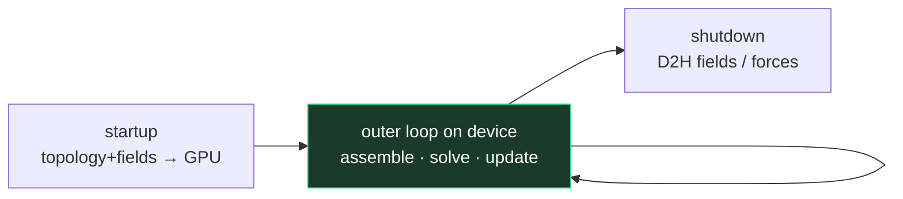

# S5 / Primary v2 — device-resident OpenFOAM outer loop

**How to plug this into an external OpenFOAM case today:**  
→ **[`docs/INTEGRATE_OPENFOAM.md`](INTEGRATE_OPENFOAM.md)** (Mode A export is the supported path; Mode B/C are this ladder).

**Primary v1** (`cases/windTunnel3D` on CPU) is **done**.  
**Primary v2** (see `docs/GOALS.md`): the **SIMPLE outer solve loop** for that class of case runs as a **full-device lifecycle** — because that is where the bottleneck hypothesis lives (assemble + sparse solve + field update every iteration), not mesh gen or ParaView.

S5 is the **implementation spine** of primary v2:

| Tier | Meaning |
|------|---------|
| v2a | One linear system (e.g. pressure) in the **SIMPLE** outer loop on GPU |
| v2b | Full **SIMPLE** outer loop: U, p, turbulence assemble+solve on GPU |
| v2c | Optional fidelity while keeping residency |
| **v3** | **PIMPLE** on GPU (time + correctors) — **only after v2b is green** |

## Target lifecycle (unchanged)

```
startup:  mesh topology + fields + constants → GPU   (once)
loop:     assemble operators + PCG/precond + field update  on GPU
shutdown: download fields / forces for I/O               (once / rare)
```



Not: assemble on CPU → copy A → solve → copy x every iteration.

Integration picture (Mode A today → v2 later): [`INTEGRATE_OPENFOAM.md`](INTEGRATE_OPENFOAM.md).

## Ladder toward S5

| Step | Deliverable | Status |
|------|-------------|--------|
| 1 | 2D structured DIA Laplace, full-device PCG + poly2 | **done** (`laplaceOcl`) |
| 2 | 3D structured DIA Poisson (7-point), same lifecycle | **done** (`--nz N`, MAX_ABS_ERR ~ 1e-13 on 32³) |
| 3 | CSR SpMV + PCG full-device (unstructured-ready format) | **done** (`apps/csrOcl`, host CSR assemble + one upload) |
| 3b | Import mesh topology CSR from polyMesh (graph Laplace) | **done** (`polyMesh_to_mtx.py` + `csrOcl --mtx`) — windTunnel 76k cells |
| 3c | Import **coefficient** matrix from OF pressure Laplacian | **done** (`apps/ofDumpCsr` → `csrOcl --mtx`) — windTunnel n=76k, residual OK ~70 ms |
| 4 | **v2a:** pressure inside **SIMPLE** via `pfcSimpleFoam` + `csrOcl` (Mode B bridge) | **done** (file-watch; not full residency yet) |
| 5 | Residual / field band vs stock OF on windTunnel3D | gate for v2a |
| 6 | **v2b:** full **SIMPLE** outer loop (U, p, k/ε) assemble+solve on device | primary v2 done |
| 7 | **v3:** **PIMPLE** device loop (reuse v2 kernels + time/correctors) | after v2b |

## Wind-tunnel coupling sketch (mvp)

1. Run stock `simpleFoam` mesh + fields as today.  
2. Export or map the pressure matrix once per outer iteration **on device** if reassembled, or freeze topology and update coefficients in-place.  
3. Device PCG returns `p` correction; host continues SIMPLE outer loop until mvp proves residency.  
4. Later: U/turbulence segments, then multi-equation full-device outer loop.

## Non-goals for first S5 cut

- Bit-identical float vs OpenFOAM (residual band is enough).  
- Full turbulence models on GPU.  
- MPI multi-GPU.

## Validation

- Same mesh as `cases/windTunnel3D` (or a smaller clone).  
- Report: `REL_RESIDUAL`, Cd/Cl vs CPU reference within a stated band.  
- Traffic: `h2d` field ≈ 0 after startup; matrix not re-downloaded.
